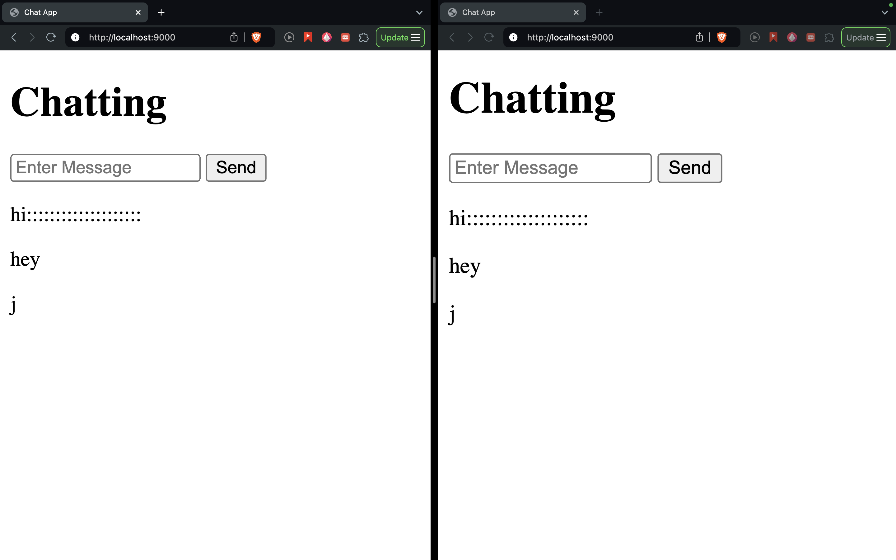

# Socket.IO Introduction
This project serves as a basic introduction to Socket.IO. It demonstrates how to establish a connection between a client and a server, send messages, and receive responses in real-time.

Socket.IO is a powerful library that enables real-time, bi-directional communication between web clients and servers. It is built on top of WebSockets and provides additional features like fallback to HTTP long-polling for older browsers, automatic reconnection, and more.

